1. Infrastructure 
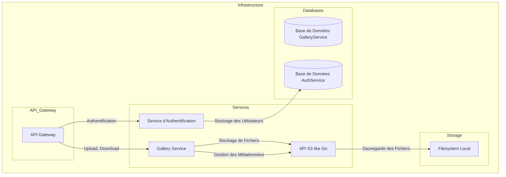
1. API Gateway

Description : L'API Gateway sert de point d'entrée unique pour toutes les requêtes venant des utilisateurs. Elle gère le routage des requêtes vers les différents services et applique les règles de sécurité, comme la vérification des tokens d'authentification.

Rôle : Routage des requêtes vers les microservices appropriés (GalleryService, AuthService, ApiS3).
Vérification de l'authentification et gestion des accès aux services protégés.
Aggrégation des réponses de plusieurs services si nécessaire.

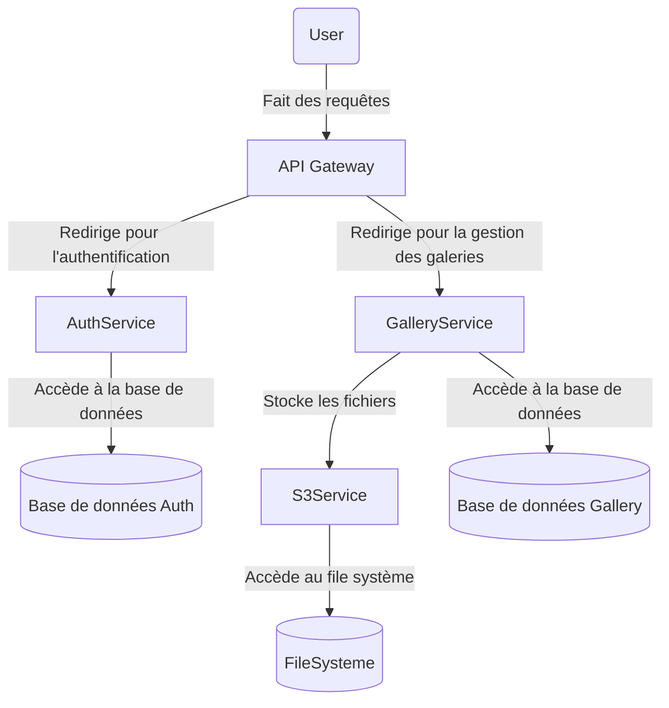
2. AuthService (Service d'Authentification)

Description : Ce microservice gère l'authentification des utilisateurs, y compris l'enregistrement, la connexion, et la gestion des tokens d'authentification.

Rôle : Gérer l'inscription et la connexion des utilisateurs.
Générer et valider les tokens JWT pour l'authentification.
Stocker les informations des utilisateurs dans la base de données associée (AuthDB).

Base de Données (AuthDB) : Contient les informations des utilisateurs, telles que les identifiants et les données d'authentification.

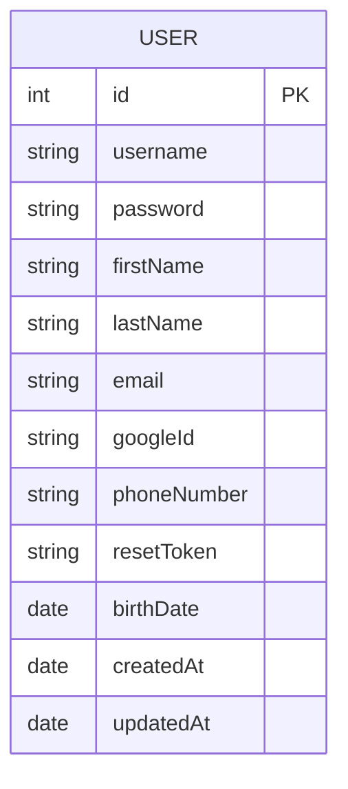
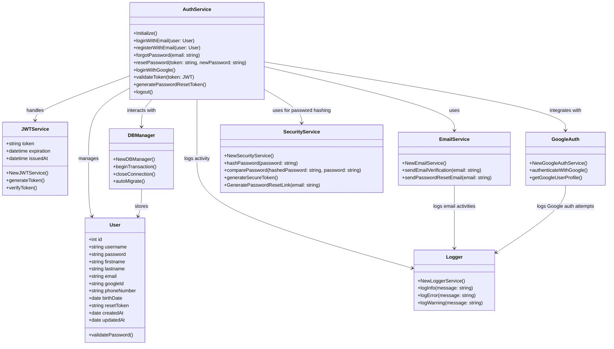
Diagramme de séquence login

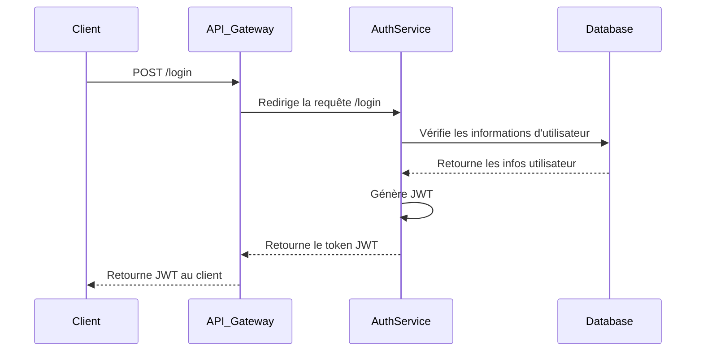

3. GalleryService

Description : Le GalleryService gère les opérations sur les fichiers multimédia (photos, vidéos) ainsi que les métadonnées associées. Il permet de créer, lire, mettre à jour, et supprimer les fichiers et les albums, ainsi que de gérer les droits d'accès.

Rôle : Gérer les albums, les fichiers, et les métadonnées associées.
Interagir avec l'API S3-like pour stocker et récupérer les fichiers.
Stocker les métadonnées des fichiers dans la base de données associée (GalleryDB).
Base de Données (GalleryDB) : Stocke les informations sur les fichiers, les albums, les droits d'accès et autres métadonnées.

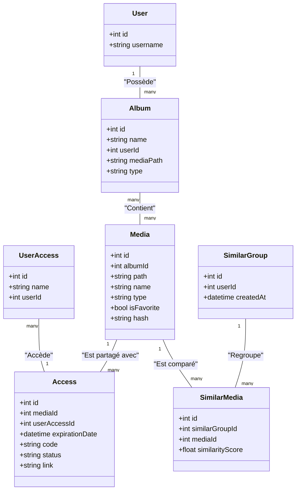
Diagramme de séquence lien

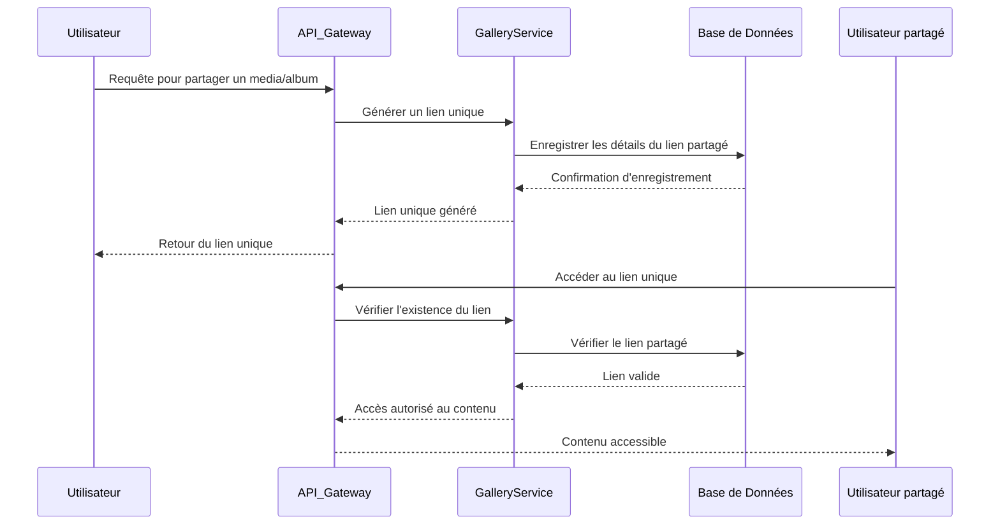
Diagramme de séquence code

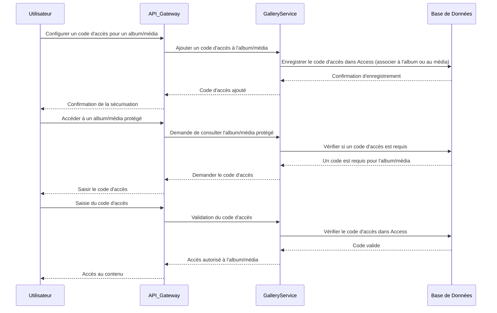
4. API S3-like (Go)

Description : C'est un service de gestion de fichiers qui imite les fonctionnalités d'un service de stockage de type S3. Il permet de gérer les fichiers et dossiers via un système de fichiers local.

Rôle : Gérer le stockage physique des fichiers ( list,upload, download, suppression).
Manipuler les dossiers et les fichiers via le système de fichiers local.
Fournir une interface pour les autres services (comme GalleryService) pour interagir avec les fichiers.

Diagramme de classe

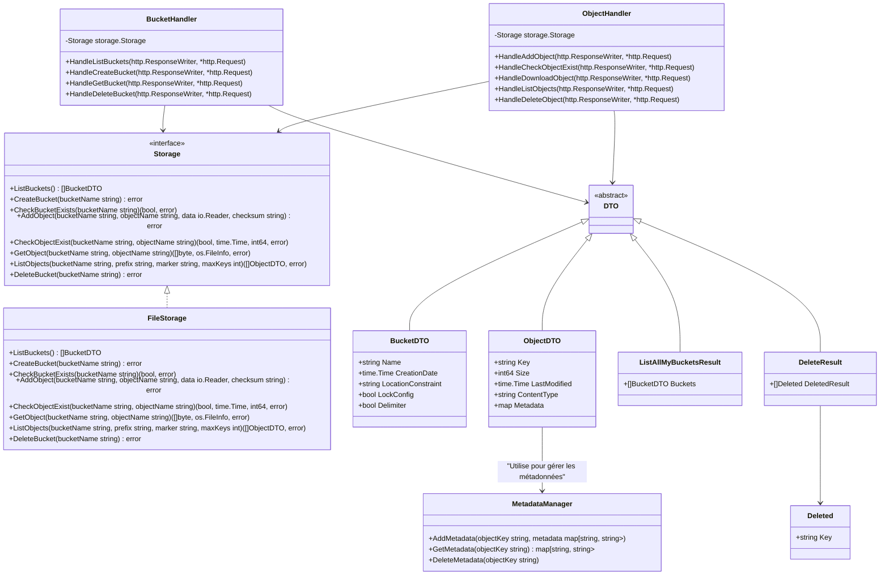

Diagramme de séquence upload

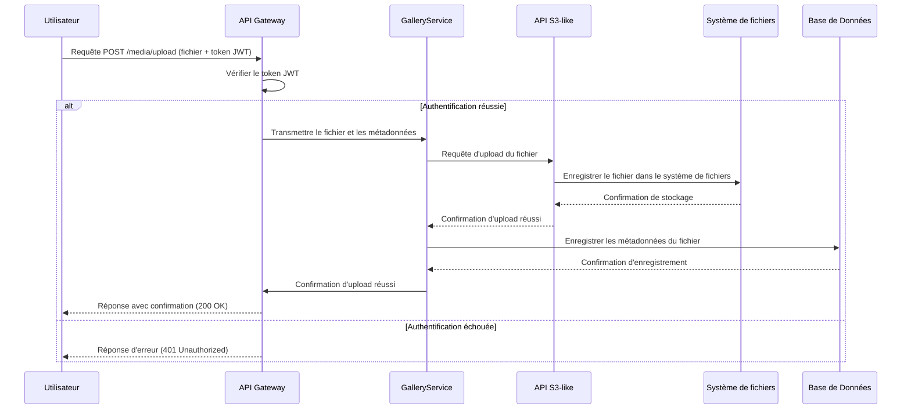

Diagramme de séquence killerFeature photos similaires 

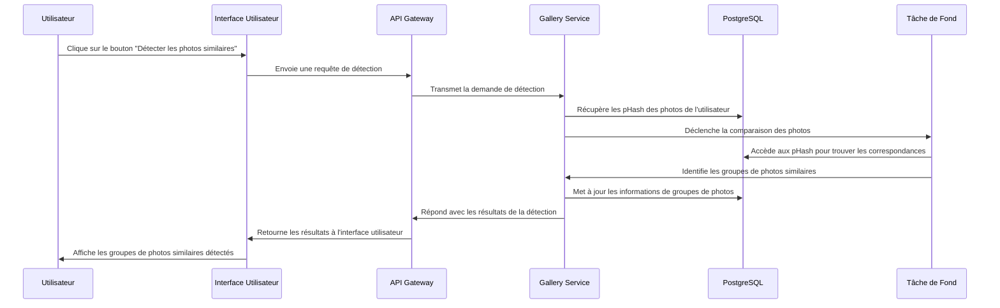

5. Système de Fichiers (Filesystem Local)

Description : Le système de fichiers local est utilisé pour stocker physiquement les fichiers. Les données binaires (photos, vidéos) sont enregistrées et récupérées ici via l'API S3-like.

Rôle : Héberger les fichiers uploadés par les utilisateurs.
Servir de stockage persistant pour les données binaires.

Diagramme de séquence de la création d'un bucket

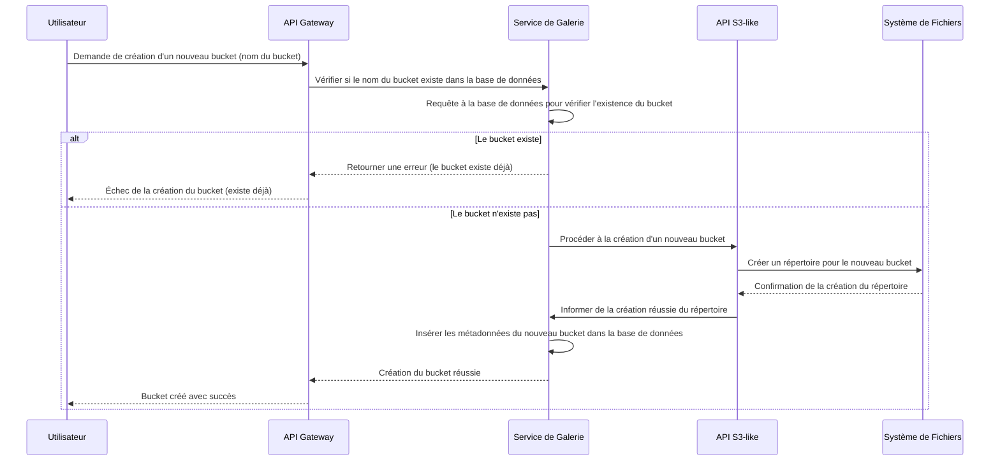

Fonctionnement Global :

Authentification et Sécurité : Les utilisateurs s'authentifient via l'AuthService, qui gère les tokens JWT. L'API Gateway vérifie les tokens avant de permettre l'accès aux services protégés.

Gestion des Fichiers : Les utilisateurs peuvent uploader des fichiers via l'API Gateway, qui transmet les requêtes au GalleryService. Le GalleryService utilise l'API S3-like pour gérer le stockage physique des fichiers.

Stockage des Métadonnées : Les métadonnées liées aux fichiers (comme le chemin, les droits d'accès, les informations d'album) sont stockées dans le GalleryDB.

Interaction entre les Services : L'API Gateway assure la communication entre les différents services, routant les requêtes et appliquant les règles de sécurité.

